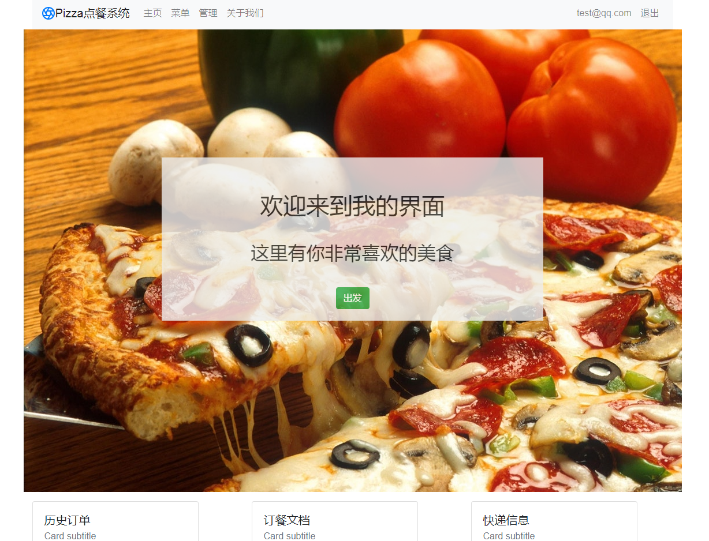
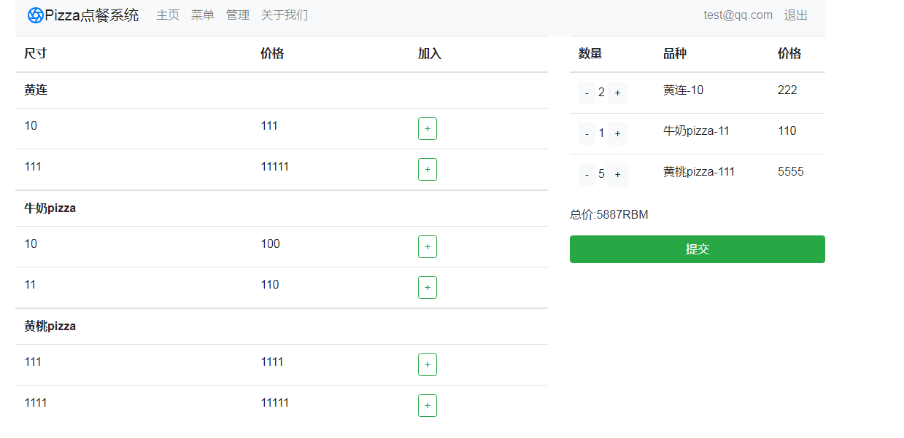
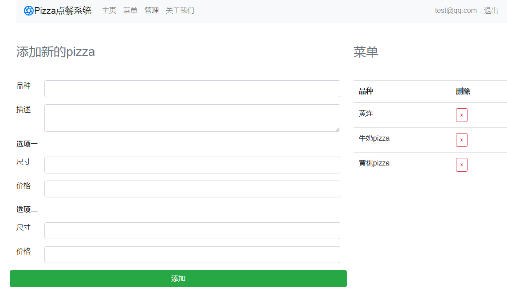
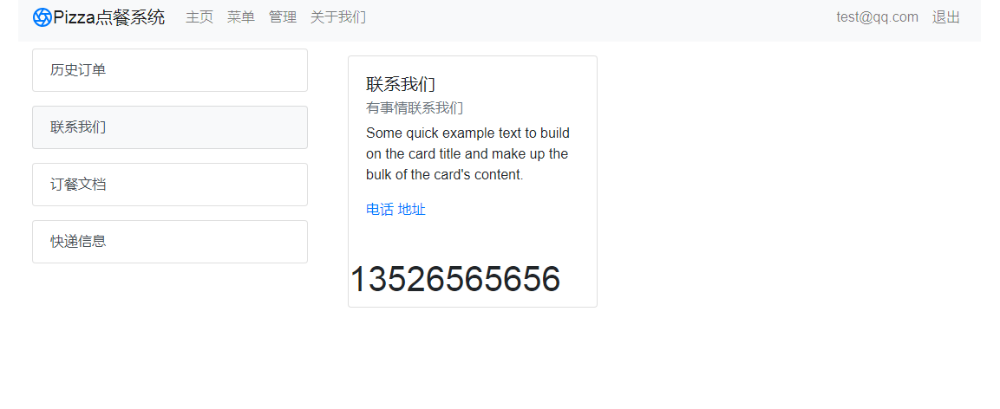

# 基于vue实现一个点餐案例

使用bootstrap搭建界面布局，使用网上野狗存储数据，实现登录注册
> vue2.0 + vuex + axios

## 项目结构
```
  |——— build  #webpack编译相关文件目录，一般不需要动
	|——— config  #配置环境变量
	|    |——— dev.env.js #开发环境变量
	|		 |——— index.js   #主配置文件
	|    |——— prod.js    #生产环境变量
	|——— node_modules #一些常用安装的依赖
	|——— src #前端项目源码目录
	|    |——— assets  #资源目录
	|    |——— components   #组件以及页面文件目录
	|    |——— router  #路由目录
	|    |——— store   #数据状态管理
	|    |——— App.vue #项目入口文件
	|    |——— main.js #项目核心文件
	|——— static       #开发模式下静态资源目录
	|——— index.html   #首页入口文件，你可以添加一些 meta 信息或同统计代码啥的
	|——— package.json #项目配置文件
	|___ README.md    #项目的说明文档，markdown 格式
```
## 相关技术
	1. vuejs2.0：一套构建用户界面的渐进式框架，易用、灵活、高效。
	2. vue-router：官方的路由组件，配合vue.js创建单页应用（SPA）非常简单。
	3. axios: 基于 Promise 的 HTTP 请求客户端，可同时在浏览器和 node.js 中使用。
	4. vuex 集中式存储管理应用的所有组件的状态
	
	
## 项目编译和运行
    1. 可以直接在git上下载项目源码。把github下载到本地，
	git clone git@github.com:MrZHLF/vue-pizza.git
	2. 进入到tourism目录，进行初始化，安装依赖
		npm run dev
	3. 依赖安装成功后执行启动命令
	   npm run dev 
	   如果显示一下内容说明安装成功
	   I  Your application is running here: http://localhost:8080
		
## 成果展示
 



